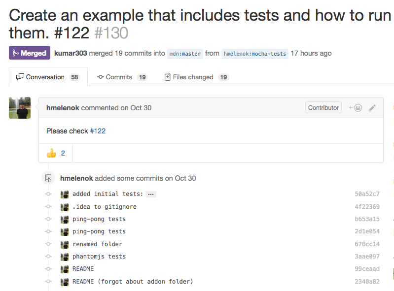
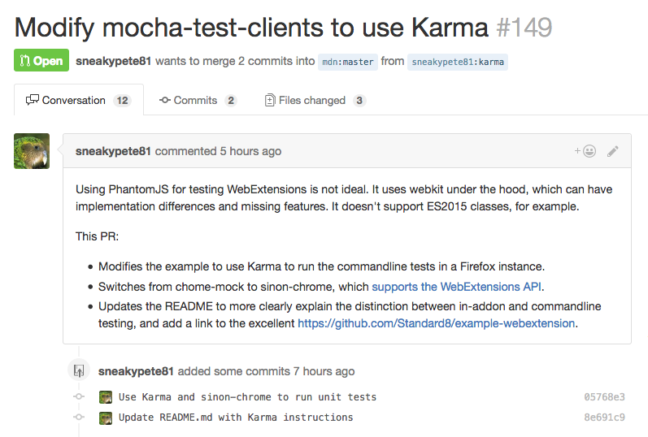

% Open source collaboration
% Kumar McMillan
% 2016

#

Open source collaboration

# 

# 

# Open source is magical

# Is open source a tax on our time?

#

* Yes, it takes more time.
* Yes, it's worth it.

# Open source at Mozilla

* What works? What doesn't?
* Testimonials
  * [jpm](https://github.com/mozilla-jetpack/jpm)
  * [web-ext](https://github.com/mozilla/web-ext)

# jpm: a tool for developing SDK add-ons

* New maintainer: me?
* 100+ open pull requests
* Open issues for days

# If you build it [and it's useful] they will come

# web-ext: a tool for developing WebExtensions

* Created Feb 1st 2016
* 19 contributors (4 employees)

# Contributor types:

* Feature X is broken
* I want feature X
* I want to learn cool stuff!
* This is fun!

# What makes it fun? Instant gratification!

* easy to install
* fast unit tests

# Documentation is essential

* README.md
  * What does it do?
  * Why should I be excited?
* CONTRIBUTING.md
  * How do I run the tests?

# Don't trap people in a wiki maze

# .github/ ISSUE_TEMPLATE.md

# First contact with a contributor

* You only get one first impression
* Be nice and stuff
* Reject patches politely

#

<strike>"If you can't figure out how to make the change, you're not qualified"</strike>

# Empathy
